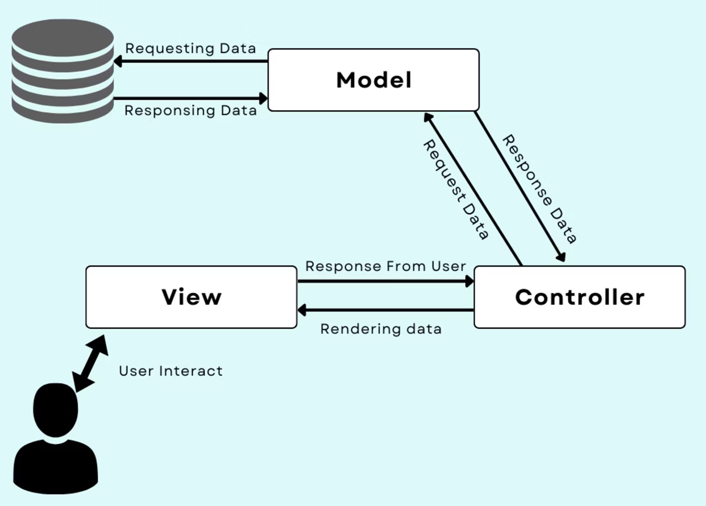

# Lab 8: Laravel — The PHP Framework


# Introduction to Laravel

Laravel is a powerful, scalable PHP framework based on the MVC (Model-View-Controller) architecture, designed for developing complex and secure web applications.

It provides:
- Structure
- A starting point for application development
- Powerful built-in features
- An amazing developer experience
- Large global community support

---

# Full Stack Development Made Easy

Laravel is a **Full Stack Framework**, enabling developers to create complete applications efficiently.

It simplifies complex tasks so developers can focus more on:
- Core business logic
- Application features

Instead of:
- Boilerplate code
- Repetitive setup work

---

# Creating Your First Laravel Project

Use the following Composer command:

```bash
composer create-project laravel/laravel app-name
```

---

# Key Features of Laravel

## Authentication

Laravel simplifies user authentication.

Minimal configuration is required for:
- Model
- View
- Controller

Authentication support has been included since Laravel 5.

---

## Security

Laravel enhances application security using the:

```text
Bcrypt Hashing Algorithm
```

This is used to:
- Generate hashed passwords
- Store passwords securely

Benefits:
- Passwords are difficult to reverse
- Improved account security

---

## Unit Testing

Laravel provides built-in Unit Testing features.

Advantages:
- Ensures new updates do not break old functionality
- Helps maintain software quality
- Detects issues early

---

# Features: Dynamic Templates and Database Management

## Dynamic Template

Laravel uses the **Blade Template Engine**.

Blade allows developers to:
- Create dynamic pages easily
- Reuse layouts
- Render data efficiently

---

## Database Migrations

Database migrations help developers:
- Share database schemas
- Create database tables
- Modify database tables

Migration files contain PHP code for database structure management.

---

## Artisan Command-Line Tool

Laravel includes a built-in command-line tool called:

```text
Artisan
```

Artisan is used for:
- Creating skeleton code
- Creating database schemas
- Running migration files
- Managing Laravel applications

---

# The Core: MVC Architecture

To understand Laravel properly, it is important to understand the:




MVC divides the application into three separate components.

Benefits:
- Better maintainability
- Faster development
- Cleaner code structure

---

# MVC Components: Model

## Model — Data Interaction Layer

The Model handles all application data.

Responsibilities:
- Retrieve data from database
- Perform operations on data
- Store data back into database

The Model manages communication between:
- Database
- User Interface (View)

---

# MVC Components: View

## View — The User Interface

The View handles the User Interface (UI).

Responsibilities:
- Display data to users
- Define templates returned to browser
- Create visual interface elements

Examples:
- Buttons
- Textboxes
- Dropdown menus

---

# MVC Components: Controller

## Controller — The Application’s Heart

The Controller connects:
- Model
- View

Responsibilities:
- Handle business logic
- Process user input
- Fetch data from Model
- Pass data to View
- Store user data through Model

---

# Why Choose MVC?

## Code Separation

MVC separates:
- User interface
- Data
- Business logic

This improves:
- Clarity
- Organization

---

## Easier Maintenance

Changes in one part of the application do not heavily affect other parts.

Benefits:
- Easier debugging
- Easier updates
- Cleaner project management

---

## Faster Development

MVC supports smoother development processes.

Especially useful for:
- Large-scale projects
- Team collaboration
- Asynchronous method invocation

---

# Laravel: Scalable for Any Project

## Startups

Laravel is scalable for:
- Small projects
- Rapid development
- Startup applications

---

## Mid-Scale Applications

Laravel provides robust support for:
- Growing businesses
- Medium-sized systems
- Multi-user applications

---

## Enterprise Applications

Laravel supports:
- Large-scale systems
- Complex enterprise applications
- High-performance applications

Laravel includes nearly every feature needed for enterprise development.

---

# Advantages of Laravel

- MVC architecture
- Secure authentication
- Blade template engine
- Database migrations
- Artisan command-line tool
- Unit testing support
- Large community support
- Scalable framework

---

# Common Laravel Commands

## Run Development Server

```bash
php artisan serve
```

---

## Create Controller

```bash
php artisan make:controller UserController
```

---

## Create Model

```bash
php artisan make:model User
```

---

## Create Migration

```bash
php artisan make:migration create_users_table
```

---

## Run Migration

```bash
php artisan migrate
```

---

# Typical Laravel Project Structure

```text
app/
bootstrap/
config/
database/
public/
resources/
routes/
storage/
tests/
vendor/
```

---

# Basic Laravel Workflow

1. Install Laravel
2. Configure Database
3. Create Models
4. Create Controllers
5. Create Views
6. Define Routes
7. Run Migrations
8. Test Application

---

# Class Task

## Task Requirements

Create a simple Laravel application.

Requirements:
- Use MVC architecture
- Create Model
- Create View
- Create Controller
- Connect database
- Run the application locally

---

# Notes

- Use Blade templates properly
- Follow MVC structure
- Organize project files clearly
- Use migrations for database management

---
